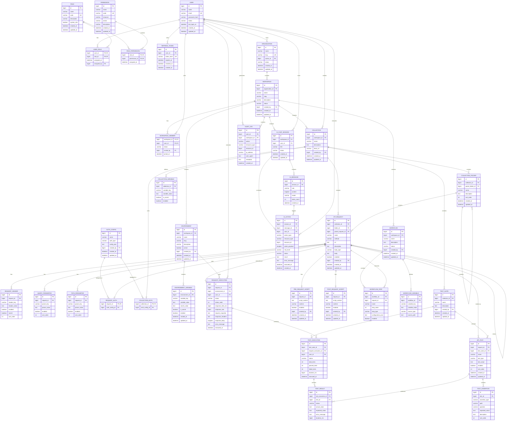

```mermaid
erDiagram
    USER {
        bigint id PK
        varchar name
        varchar email UK
        varchar password_hash
        varchar status
        datetime last_login_at
        datetime created_at
        datetime updated_at
    }

    ROLE {
        bigint id PK
        varchar name
        varchar code UK
        varchar description
        boolean system_role
        datetime created_at
        datetime updated_at
    }

    PERMISSION {
        bigint id PK
        varchar name
        varchar code UK
        varchar resource
        varchar action
        varchar description
        datetime created_at
        datetime updated_at
    }

    USER_ROLE {
        bigint user_id PK, FK
        bigint role_id PK, FK
        datetime assigned_at
        bigint assigned_by FK
    }

    ROLE_PERMISSION {
        bigint role_id PK, FK
        bigint permission_id PK, FK
        datetime assigned_at
    }

    REFRESH_TOKEN {
        bigint id PK
        bigint user_id FK
        varchar token_hash UK
        datetime expires_at
        datetime revoked_at
        datetime created_at
    }

    ORGANIZATION {
        bigint id PK
        varchar name
        varchar slug UK
        bigint owner_id FK
        varchar status
        datetime created_at
        datetime updated_at
    }

    WORKSPACE {
        bigint id PK
        bigint organization_id FK
        varchar name
        varchar slug
        varchar description
        varchar status
        bigint created_by FK
        datetime created_at
        datetime updated_at
    }

    WORKSPACE_MEMBER {
        bigint workspace_id PK, FK
        bigint user_id PK, FK
        varchar status
        bigint invited_by FK
        datetime joined_at
    }

    COLLECTION {
        bigint id PK
        bigint workspace_id FK
        varchar name
        text description
        varchar base_url
        bigint created_by FK
        datetime created_at
        datetime updated_at
    }

    COLLECTION_FOLDER {
        bigint id PK
        bigint collection_id FK
        bigint parent_folder_id FK
        varchar name
        text description
        int sort_order
        datetime created_at
        datetime updated_at
    }

    API_REQUEST {
        bigint id PK
        bigint collection_id FK
        bigint folder_id FK
        bigint parent_request_id FK
        varchar name
        varchar method
        text url
        text description
        varchar body_type
        text body
        boolean enabled
        bigint created_by FK
        datetime created_at
        datetime updated_at
    }

    REQUEST_HEADER {
        bigint id PK
        bigint request_id FK
        varchar header_key
        text header_value
        boolean enabled
        boolean secret
        int sort_order
    }

    QUERY_PARAMETER {
        bigint id PK
        bigint request_id FK
        varchar param_key
        text param_value
        boolean enabled
        int sort_order
    }

    PATH_PARAMETER {
        bigint id PK
        bigint request_id FK
        varchar param_key
        text param_value
        boolean enabled
        int sort_order
    }

    AUTH_CONFIG {
        bigint id PK
        varchar name
        varchar auth_type
        text config_json
        bigint created_by FK
        datetime created_at
        datetime updated_at
    }

    REQUEST_AUTH {
        bigint request_id PK, FK
        bigint auth_config_id FK
    }

    COLLECTION_AUTH {
        bigint collection_id PK, FK
        bigint auth_config_id FK
    }

    ENVIRONMENT {
        bigint id PK
        bigint workspace_id FK
        varchar name
        varchar slug
        varchar description
        boolean active
        bigint created_by FK
        datetime created_at
        datetime updated_at
    }

    ENVIRONMENT_VARIABLE {
        bigint id PK
        bigint environment_id FK
        varchar variable_key
        text variable_value
        text secret_value
        boolean is_secret
        boolean enabled
        datetime created_at
        datetime updated_at
    }

    COLLECTION_VARIABLE {
        bigint id PK
        bigint collection_id FK
        varchar variable_key
        text variable_value
        boolean is_secret
        boolean enabled
    }

    TEST_SUITE {
        bigint id PK
        bigint collection_id FK
        varchar name
        text description
        bigint created_by FK
        datetime created_at
        datetime updated_at
    }

    API_TEST {
        bigint id PK
        bigint request_id FK
        bigint test_suite_id FK
        varchar name
        varchar test_type
        text test_script
        boolean enabled
        int sort_order
        datetime created_at
        datetime updated_at
    }

    TEST_ASSERTION {
        bigint id PK
        bigint test_id FK
        varchar assertion_type
        varchar path
        varchar operator
        text expected_value
        text description
        int sort_order
    }

    PRE_REQUEST_SCRIPT {
        bigint id PK
        bigint request_id FK
        text script_content
        varchar runtime
        boolean enabled
        bigint created_by FK
        datetime created_at
        datetime updated_at
    }

    POST_REQUEST_SCRIPT {
        bigint id PK
        bigint request_id FK
        text script_content
        varchar runtime
        boolean enabled
        bigint created_by FK
        datetime created_at
        datetime updated_at
    }

    WORKFLOW {
        bigint id PK
        bigint workspace_id FK
        varchar name
        text description
        varchar status
        bigint created_by FK
        datetime created_at
        datetime updated_at
    }

    WORKFLOW_STEP {
        bigint id PK
        bigint workflow_id FK
        bigint request_id FK
        varchar name
        int step_order
        varchar step_type
        text configuration_json
        boolean enabled
    }

    WORKFLOW_VARIABLE {
        bigint id PK
        bigint workflow_id FK
        varchar variable_key
        text variable_value
        varchar source_type
        text source_path
    }

    REQUEST_EXECUTION {
        bigint id PK
        bigint request_id FK
        bigint environment_id FK
        bigint user_id FK
        varchar status
        int status_code
        bigint response_time_ms
        bigint response_size
        text request_snapshot
        text response_headers
        longtext response_body
        text error_message
        datetime executed_at
    }

    TEST_EXECUTION {
        bigint id PK
        bigint test_suite_id FK
        bigint request_execution_id FK
        bigint user_id FK
        varchar status
        int total_tests
        int passed_tests
        int failed_tests
        bigint duration_ms
        datetime executed_at
    }

    TEST_RESULT {
        bigint id PK
        bigint test_execution_id FK
        bigint test_id FK
        varchar status
        text actual_value
        text expected_value
        text error_message
        bigint duration_ms
    }

    AI_CHAT_SESSION {
        bigint id PK
        bigint workspace_id FK
        bigint user_id FK
        varchar title
        varchar status
        datetime created_at
        datetime updated_at
    }

    AI_MESSAGE {
        bigint id PK
        bigint session_id FK
        varchar role
        longtext content
        varchar model
        int token_count
        datetime created_at
    }

    AI_ACTION {
        bigint id PK
        bigint session_id FK
        bigint message_id FK
        bigint user_id FK
        varchar action_type
        varchar resource_type
        bigint resource_id
        longtext action_payload
        varchar risk_level
        varchar status
        text result
        text error_message
        datetime executed_at
        datetime created_at
    }

    AUDIT_LOG {
        bigint id PK
        bigint user_id FK
        bigint workspace_id FK
        varchar action
        varchar resource_type
        bigint resource_id
        varchar ip_address
        text user_agent
        text metadata
        datetime created_at
    }


    USER ||--o{ USER_ROLE : has
    ROLE ||--o{ USER_ROLE : assigned_to

    ROLE ||--o{ ROLE_PERMISSION : grants
    PERMISSION ||--o{ ROLE_PERMISSION : contains

    USER ||--o{ REFRESH_TOKEN : owns

    USER ||--o{ ORGANIZATION : owns
    ORGANIZATION ||--o{ WORKSPACE : contains

    WORKSPACE ||--o{ WORKSPACE_MEMBER : has
    USER ||--o{ WORKSPACE_MEMBER : joins

    WORKSPACE ||--o{ COLLECTION : contains
    USER ||--o{ COLLECTION : creates

    COLLECTION ||--o{ COLLECTION_FOLDER : contains
    COLLECTION_FOLDER ||--o{ COLLECTION_FOLDER : contains

    COLLECTION ||--o{ API_REQUEST : contains
    COLLECTION_FOLDER ||--o{ API_REQUEST : contains

    API_REQUEST ||--o{ API_REQUEST : chains

    API_REQUEST ||--o{ REQUEST_HEADER : has
    API_REQUEST ||--o{ QUERY_PARAMETER : has
    API_REQUEST ||--o{ PATH_PARAMETER : has

    AUTH_CONFIG ||--o{ REQUEST_AUTH : assigned_to
    API_REQUEST ||--o| REQUEST_AUTH : uses

    AUTH_CONFIG ||--o{ COLLECTION_AUTH : assigned_to
    COLLECTION ||--o| COLLECTION_AUTH : uses

    WORKSPACE ||--o{ ENVIRONMENT : contains
    ENVIRONMENT ||--o{ ENVIRONMENT_VARIABLE : contains

    COLLECTION ||--o{ COLLECTION_VARIABLE : defines

    COLLECTION ||--o{ TEST_SUITE : contains
    API_REQUEST ||--o{ API_TEST : tested_by
    TEST_SUITE ||--o{ API_TEST : contains

    API_TEST ||--o{ TEST_ASSERTION : contains

    API_REQUEST ||--o| PRE_REQUEST_SCRIPT : has
    API_REQUEST ||--o| POST_REQUEST_SCRIPT : has

    WORKSPACE ||--o{ WORKFLOW : contains
    WORKFLOW ||--o{ WORKFLOW_STEP : contains
    API_REQUEST ||--o{ WORKFLOW_STEP : executes

    WORKFLOW ||--o{ WORKFLOW_VARIABLE : defines

    API_REQUEST ||--o{ REQUEST_EXECUTION : executed_as
    ENVIRONMENT ||--o{ REQUEST_EXECUTION : uses
    USER ||--o{ REQUEST_EXECUTION : executes

    TEST_SUITE ||--o{ TEST_EXECUTION : runs
    REQUEST_EXECUTION ||--o{ TEST_EXECUTION : produces

    TEST_EXECUTION ||--o{ TEST_RESULT : contains
    API_TEST ||--o{ TEST_RESULT : produces

    WORKSPACE ||--o{ AI_CHAT_SESSION : contains
    USER ||--o{ AI_CHAT_SESSION : owns

    AI_CHAT_SESSION ||--o{ AI_MESSAGE : contains
    AI_CHAT_SESSION ||--o{ AI_ACTION : produces
    AI_MESSAGE ||--o{ AI_ACTION : triggers
    USER ||--o{ AI_ACTION : executes

    USER ||--o{ AUDIT_LOG : generates
    WORKSPACE ||--o{ AUDIT_LOG : contains
```